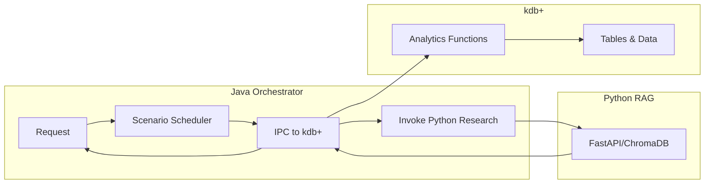

# Project architecture

## Technology:
- kdb+ (q language)
- Time-series tables
- In-memory analytics
- Modular design

## Tech Stack Rules
- **Java 21/25:** Primary orchestrator. Use LangChain4j for AI and `kx-kdb` for IPC.
- **kdb+ (q):** Analytical core. Vector-first math for DV01, Gamma, and Convexity.
- **Python 3.12:** RAG Knowledge Base. Use FastAPI and ChromaDB for research synthesis.

## Domain Specifics (JGB)
- **Convention:** Act/365 Day Count.
- **Key Metrics:** DV01 (Price sensitivity to 1bp move), YTM (Yield to Maturity).
- **Market Scope:** 2Y, 5Y, 10Y, 20Y, 30Y JGBs and JGB Futures.
- **BoJ Scenarios:** Handle parallel shifts and curve flattening/steepening.

## Architecture Patterns
- **Agentic Loop:** Java Agent -> kdb+ (Quant Data) -> Python (Research RAG) -> Synthesis.
- **Concurrency:** Use Java Virtual Threads (Loom) for non-blocking I/O with kdb+ and Python.
- **Precision:** All bond math results must be validated against the `q` reference implementation.

## Layered Architecture
1. **Data Layer**
   - kdb+ time-series databases storing yield curves, bond static data, and scenario outputs.
   - Tables defined with canonical schemas (e.g. `yields`, `bonds`, `portfolios`).
   - Snapshot and tick ingestion routines written in q.
2. **Analytics Layer**
   - q modules for pricing, duration, convexity, DV01 and scenario generation.
   - Functions packaged as `.q` libraries loading into kdb+ processes.
   - Java wrappers expose analytics via `kx-kdb` IPC.
3. **Orchestration Layer**
   - Java 21/25 application orchestrating workflow, scheduling scenario runs, and managing portfolio P&L aggregation.
   - Uses LangChain4j to coordinate agentic loop calls and manage virtual threads.
   - Communication with kdb+ over TCP using the official driver; errors handled via structured logging.
4. **Research & RAG Layer**
   - Python FastAPI service providing RAG capabilities over ChromaDB for documentation and spec lookups.
   - Offloads heavy language-model tasks from Java and kdb+.
5. **API & Client Layer**
   - Exposes REST/GRPC endpoints for external clients to request analytics, run scenarios, and fetch results.
   - Initially consumed by internal tools or CLI; future GUI plug‑in possible.

## Data & Control Flow

## Deployment Considerations
- All components run within the same network segment; kdb+ instances configured with multi-core licences for high throughput.
- Java and Python services containerised for reproducibility; unit tests invoked via Maven/Pytest.
- Build commands per component already defined in README.

## Testing Strategy
- Reference q scripts (`check_math.q`) used to validate analytic results.
- Java integration tests mock kdb+ responses using an in-memory stub.
- Python RAG unit tests rely on local ChromaDB fixtures.

## Future Extensions
- Add support for JGB futures & options in analytics layer.
- Replace REST layer with gRPC streaming for real-time risk updates.
- Introduce GUI dashboard using React, consuming API layer.

### Phase2 1. kdb+ (Risk Data Engine)
- Host: localhost
- Port: 5001
- Stores:
  - Yield curve
  - Bond static data
  - Portfolio positions
- Use q-SQL for aggregation

###  Phase2  2. Java (Orchestrator)
- Pricing requests
- Scenario engine
- Portfolio aggregation
- Use Virtual Threads for parallel risk computation

---

## Phase2  2 (AI Layer – Optional)

### Python Sidecar
- FastAPI service
- RAG over research PDFs
- ChromaDB vector store
- Provides:
  - Risk explanation
  - Macro interpretation
  - BoJ scenario narrative